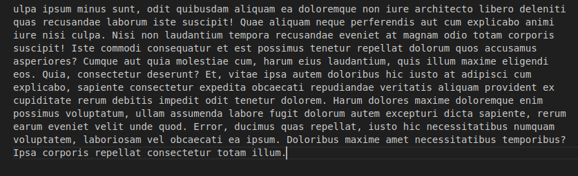
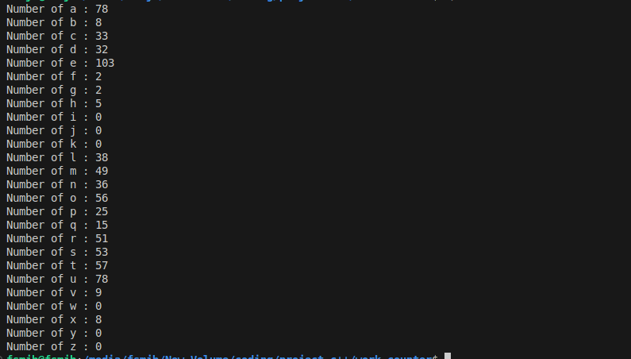

<h1>Word counter</h1>

 this code count the alpabet how many alpabet is present in input file for example how may a is present in the it check from Aa to Zz 

The pic of the input file
  
  

 The pic of the ouptur 
  
